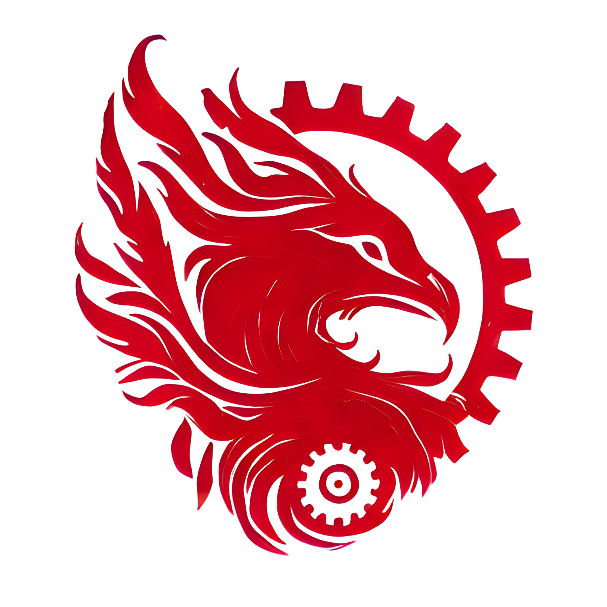

## OpenCMUQ Website



This website is created for OpenCMUQ Collectives club at Carnegie Mellon University in Qatar.

## Installation

You can clone the project directly from this repo to your local system.

### 1. Clone the repo

```bash
git clone https://github.com/open-cmuq/opencmuq-website.git
```

### 2. Install Dependencies

```bash
pnpm install
```

### 3. Start development Server

```bash
pnpm dev
```

### Preview & Build

```bash
pnpm preview
pnpm build
```

We recommend using [pnpm](https://pnpm.io/) to save disk space on your computer.

## Project Structure

Inside of your project, you'll see the following folders and files:

```
/
├── public/
│   └── ...
├── src/
│   ├── components/
│   │   └── ...
│   ├── layouts/
│   │   └── ...
│   └── pages/
│       └── ...
└── package.json
```

The project looks for `.astro` or `.md` files in the `src/pages/` directory. Each page is exposed as a route based on its file name.

Any static assets, like images, can be placed in the `public/` directory.

## Credits

[Hero Illustration](https://www.figma.com/community/file/1108400791662599811) by [Streamline](https://www.streamlinehq.com/)

This template is cloned from: https://github.com/surjithctly/astroship?tab=readme-ov-file
